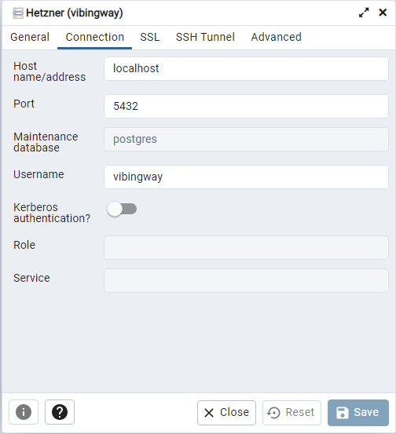
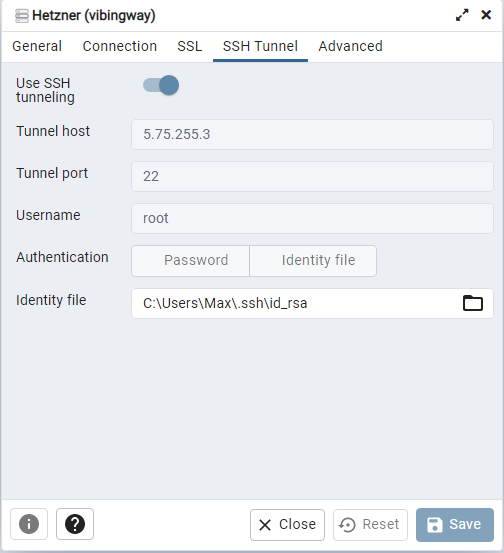

.. _guides_installation:

Installation
############

This page features a step-by-step installation guide for the bot on a linux
server.

Create a new Discord Bot
************************

First you will have to create a new Discord Bot.

Head to https://discord.com/developers/applications, create a new application
and add a bot user to it.

Head to Oauth2/General and select the following authorization settings:


Go to Oauth2/URL Generator, check ``applications.commands``, copy the generated
URL and paste it in your webbrowser to add the newly created bot to a discord
server of your choice.

Create a new Linux User
***********************

The bot will be ran under a new user on the linux host. Create a new user by
using the following commands:

.. code::

    sudo useradd -m vibingway
    sudo usermod -aG sudo vibingway

Enter an appropriate password and you're done.

Prerequisites
*************

The bot requires a set of prerequisites to be installed on the server to run.

These prerequisites are:

* Python 3.11 or higher
* Lavalink 3.7.8 or higher
* PostgreSQL 

Before going through the following steps run ``sudo apt update`` once to ensure
that the package index of your server is up to date.

Python 3.11
===========

Most Linux distributions come with Python preinstalled. Run ``python --version``
to check the installed version, if any. If the command is unknown or the version
is lower than 3.11, you will have to manually install Python 3.11.

.. code::

    sudo add-apt-repository ppa:deadsnakes/ppa
    sudo apt update 
    sudo apt install python3.11-full
    python3.11 -m ensurepip

You should now be able to start Python 3.11 using ``python3.11``.

OpenJDK 13
==========

To run the lavalink server you will have to install java 13 or higher.

.. code::

    sudo apt-get install openjdk-18-jre

See https://wiki.ubuntuusers.de/Java/Installation/OpenJDK/ for a more detailed
overview of the different distributions.

PostgreSQL
==========

.. note::

    This section is largely based on this guide: https://www.cherryservers.com/blog/how-to-install-and-setup-postgresql-server-on-ubuntu-20-04

The bot uses a PostgreSQL database which you can install as follows:

.. code::

    sudo apt install postgresql postgresql-contrib

Check whether the postgresql daemon is active:

.. code::
    
    service postgresql status

By installing PostgreSQL a default admin user ``postgres`` is created by default.
You will use this user to start an interactive session with your local database
server and set up the user and database for the bot.

.. note:: Replace ``password`` with an appropriate password.

.. code::

    sudo -u postgres psql
    create user "vibingway" with password 'password';
    create database "vibingway" with owner='vibingway';
    alter user "vibingway" with superuser;

    \q

The server is now accessible through the loopback IP address of the linux host.
If you want to be able to connect to the server from your own PC you will have
to adjust the PostgreSQL configuration to allow remote access.

.. code::

    sudo nano /etc/postgresql/14/main/postgresql.conf

In the file uncomment the line ``#listen_addresses = '*'`` and change it to
``listen_addresses = '*'``. Save your changes with ``CTRL + X``` and ``Y``.

Update the PostgreSQL access policy configuration file.

.. code::

    sudo nano /etc/postgresql/14/main/pg_hba.conf

Append a new connection policy at the bottom of the file:

.. code::

        host all all 0.0.0.0/0 md5

Save and close and restart PostgreSQL using ``systemctl restart postgresql``.

Clone the Git Repository
************************

Add an SSH key
==============

Before you can clone the git repository you will have to add a public SSH key
to your GitHub account. To that end you will first have to generate an SSH key
on your server.

.. code::

    ssh-keygen

Skip adding a passphrase. This should create a new ssh key under ``/root/.ssh/id_rsa``.

Head to https://github.com/settings/ssh/new and add a new SSH key. Paste the
contents of ``/root/.ssh/id_rsa.pub`` and save.

Clone the Repository
====================

Run the following steps to clone the repository into the home directory of the
new ``vibingway`` user you created earlier.

.. code::

    cd /home/vibingway
    git clone git@github.com:NotMaxee/Vibingway.git vibingway

Confirm the prompt to add the key and the repository should now be available
under ``/home/vibingway/vibingway``.

Setup the Lavalink Server
*************************

.. note::

    This section is largely based on this guide: https://dsharpplus.github.io/articles/audio/lavalink/setup.html.

Since we have already installed java we can now set up the lavalink server.
Head over to https://github.com/freyacodes/Lavalink/releases and copy the url
to the latest release JAR.

Run the following to create a directory for the lavalink server:

.. code::

    cd /home/vibingway/vibingway/data/lavalink
    wget https://github.com/freyacodes/Lavalink/releases/download/3.7.8/Lavalink.jar 

You should now a ``Lavalink.jar`` that can be used to run a lavalink server.

To test this you can run ``java -jar Lavalink.jar`` and it should start
launching the server. Cancel this using CTRL + C as we will instead run the
server as a service, allowing for automatic restarts.

Run the following to copy the service preset and enable the lavalink server:

.. code::

    sudo cp /home/vibingway/vibingway/data/systemd/lavalink.service /etc/systemd/system/lavalink.service
    sudo systemctl daemon-reload
    sudo systemctl enable lavalink.service
    sudo systemctl start lavalink.service

To check whether the service is running you can use ``service lavalink status``.
To check the output of the server you can use ``journalctl -u lavalink.service -e``.

Create the PostgreSQL Database
******************************

.. todo::

    Write an alternative step that does not rely on pgAdmin and works through
    the unix terminal instead.

To connect the database we are going to use pgAdmin with SSH tunneling.

Open pgAdmin and create a new server with the following settings:




Once done open the vibingway database we created previously and use the query
tool to run the SQL files found in ``data/db/`` starting with ``1-initdb.sql``.

Install Python Modules
**********************

Before we can run the bot we need to install the necessary Python modules.

.. code::

    sudo pip3.11 install -r /home/vibingway/vibingway/requirements.txt

You may optionally choose to install ``uvloop`` with ``sudo pip3.11 install uvloop``.

Create the Configuration File
*****************************

Before the final step we need to add a configuration file. 

.. code::

    cp /home/vibingway/vibingway/config.template /home/vibingway/vibingway/config.py

Edit the newly created ``config.py`` and fill in the blanks.

Create a Service
****************

Finally we create the service to run the bot.

.. code::

    sudo cp /home/vibingway/vibingway/data/systemd/vibingway.service /etc/systemd/system/vibingway.service
    sudo systemctl daemon-reload
    sudo systemctl enable vibingway.service
    sudo systemctl start vibingway.service

To check whether the service is running you can use ``service vibingway status``.
To check the output of the server you can use ``journalctl -u vibingway.service -e``.

You may also find the following commands useful:

.. code::

    # Start the service
    sudo systemctl start vibingway.service

    # Stop the service
    sudo systemctl stop vibingway.service

    # Restart the service
    sudo systemctl restart vibingway.service

    # Enable automatic launch on boot
    sudo systemctl enable vibingway.service

    # Disable automatic launch on boot
    sudo systemctl disable vibingway.service
